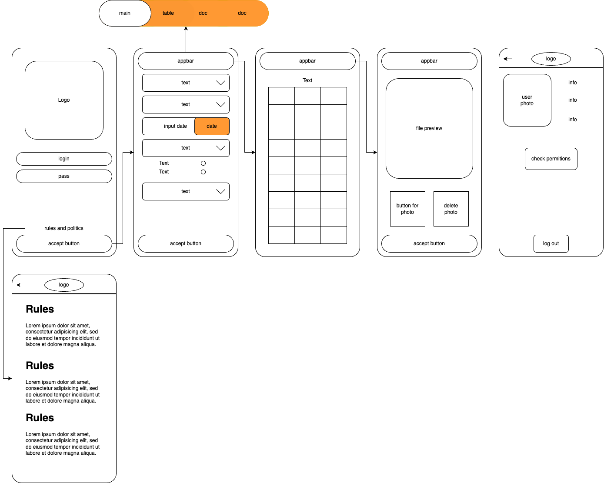
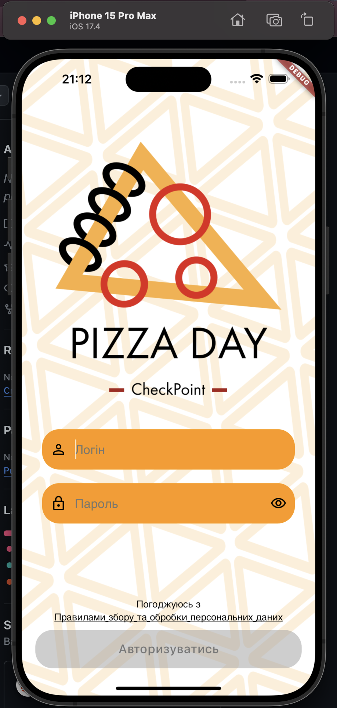

# RD_Quality_Control_APP

### Description of the project

For the course project, I chose the topic "Application for keeping warehouse records and product quality assessment."
It will include product acceptance, product quality assessment, filling in the product nomenclature, and delivery accounting documents.

Here are some possibilities and functionality that are planned to be added:

* The ability to manage the process of obtaining goods in the warehouse "from and to"
* Uploading a photo of invoices
* Entering a delivery checklist
* View the complete list of received goods in tabular form

At the moment, this is the basic functionality, all refinements will be indicated in the course of work.

### Basic structure of project:

# Current view of first page

